# 1º Slide -> Security

## Predictability of systems, processes, environments

### Across all aspects of the life cycle:

**Planning** -> Design of a solution complying with some requirements under a normative context.
Without flaws: All operations states are the ones predicted; There are no additional states escaping the expected logic (Even if forces transitions are used)

**Development** -> Implement a solution complying with the design, without other operation modes.
Without bugs compromising the correct execution: No crashes; Without invalid or unexpected results; With the correct execution times; With adequate resource consumption; Without information leaks

**Execution** -> Code excutes as it was written, with all predicted processes.
Environment is controlled, cannot be manipulated or observed
Without the existence of anomalous behavior, introduced by environmental aspects (storage speed, RAM amount, trusted communications)

**Processes**;

**People** -> Staff behavior cannot have a negative impact to the solution
Norms are in place to regulate what avtions are expected; Staff is trained to distinguish correct from incorrect behavior; Staff has the correct incentive to behave adequately; When staff is compromised, or deviate, actions have limited impact

Clients and Supply Chain;<br>
Mechanisms;<br>
Standards and Laws;<br>
Intellectual Property;

-------------------------------

### SIO ojectives:

Confidentiality;
Integrity: Information remains unchanged;<br>
Availability: Information is available to target entities;<br>
Privacy: How personal information is handled;<br>
Measures;

------------------------------

### Security objectives:

Defense against catastrophic events;<br>
Degradation of computer hardware;<br>
Defense against ordinary faults / failures;<br>
Defense against non-authorized activities (adversaries)

------------------------------

#### Core Concepts:

1. Domains -> A set of entities sharing similar security attributes<br>
Allow managing security in an aggregated manner;<br>
Behavior and interactions are homogenous inside the domain;<br>
Domains can be organized in a flat of hierarchical manner;<br>
Interactions between domains are usually controlled;<br>


2. Policies -> Set of guidelines related to security, that rule over a domain

Organization will contain multiple policies; <br>
The multiple policies  must be coherent; <br>
Define the power of each subject; <br>
Define security procedures; <br>
Define the minimun security requirements of a domain; <br>
Define defense strategies and fight back tactics; <br>
Define what are legal and illegal activities; <br>

3. Mechanisms -> Mechanisms implement policies:

Policies define, at a higher level, what needs to be done or exist <br>
Mechanisms are used to deply policies

4. Controls -> Controls are any aspect allowing to minimize risk (protect the CIA properties)

Cotrols include policies & mechanisms, but also Standars and Laws, Processes, Techniques
Controls are explicitly stated and can be auditable

------------------------------

**Policy**: Movement between domains is restricted<br>
**Mechanisms**: Doors, guards, passwords, objects/documents

**Policy**: systems must be resilient
**Mechanisms**: equipments and links are doubled, arquitecture

------------------------------

### Types of Security Controls:

|                | Prevention                                                            | Detection                       | Correction                                                                 |   |
|----------------|-----------------------------------------------------------------------|---------------------------------|----------------------------------------------------------------------------|---|
| Physical       | -Fences -Gates -Locks                                                 | -CCTV                           | -Repair Locks -Repair Windows -Redeploy access cards                       |   |
| Technical      | -Firewall -Authentication Antivirus                                   | -Intrusion -Alarms -Honeypots   | -Vulnerability patching -Reboot Systems -Redeploy VMs -Remove Virus        |   |
| Administrative | -Contractal clauses -Separation of Duties -Information Classification | -Review Access Matrixes -Audits | -Implement a business continuity plan -Implement an incident response plan |   |

------------------------------

### Practical Security: Realistic Prevention

Consider Impact;<br>
Consider the cost and recover time;<br>
Characterize attackers;<br>
Consider that the system will be compromised;

------------------------------

### Security in computing systems: Complex problems

Computers can do much damage in short time frames;<br>
The number of weakness is always growing;<br>
Networks allow novel attack mechanisms;<br>
Attackers can build complex attck chains;<br>
Users are mostrly unaware of the risks;<br>
Users are mostly careless;

------------------------------

### Main vulnerability sources:

Hostile applications or bugs in applications;<br>
Users;<br>
Defective administration;<br>
Communication over uncontrolled/unknown network links

------------------------------

### Perimeter Defense (minimal defense, frequently not sufficient)


Protection against external attackers;<br>
Assumes that internal users are trusted and share the same policies;<br>
Used in domestic scenarios or small offices;<br>
Limitaions: Too simple, Doesn't protect against internal attackers

------------------------------

### Defense in Depth:

Protection against internal and external attackers;<br>
Assumes well-defined domains across the organization;<br>
Limitations: Needs coordination between the diferent controls, Cost,<br> Requires training, changes to processes and frequent audits

------------------------------

### Zero Trust:

Defense model without specific perimeters;<br>
Model recommended for new systems

### Zero Trust - Principles (NCSC)

1. Know your architecture (Users, devices, services and data)
2. Know your identities (Users, devices , services and data)
3. Assess user behaviour, servicesand device health
4. Use policies to authhorize requests
5. Authenticate and Authorize everywhere
6. Focus your monitoring on users, devices and services
7. Don't trust any network, including you rown
8. Choose services designed for Zero Trust

------------------------------
# 2º Slide -> Vulnerabilities

## Measures (and some tools):

**Discouragement**
- Punishment: Legal restrictions, Forensic evidences
- Security barriers: Firewalls, Authentication, Secure communication, Sandboxing

**Detection**
- Intrusion detection system: Seek, Bro, Suricata
- Auditing
- Forensic break-in analysis

**Deception**
- Honeypots / honeynets
- Forensic follow-up

**Prevention**
- Restrictive policies: least privilege principle
- Vulnerability scanning: OpenVAS, metasploit
- Vulnerability patching: regular updates

**Recovery**
- Backups
- Reduntant systems
- Forensic recovery

------------------------------


------------------------------
## Vulnerability:

A mistake in software that can be directly used by an attacker to gain access to a system or network

A mistake is a vulnerability <u>if it allows an attacker to use it to violate a reasonable security policy for that system</u>
<ul>
    <li> This excludes entirelly "open" security policies in which all users are trusted, or where there is no consideration of risk to the system
</ul>

A VE vulnerability is a state in a computing system (or set of systems) that either:
<ul>
    <li>Allows an attacker to execute commands as anotehr user</li>
    <li>Allows an attacker to access data that is contrary to the specified access restrictions for that data</li>
    <li>Allows an attacker to pose as another entity</li>
    <li>Allows an attacker to conduct a denial of service</li>
</ul>

------------------------------

## Exposure:

A configuration issues or a mistake in software allowing access to informationor capabilities used as a stepping-stone into a system or network

### A configuration issue or a mistake is an exposure if it does not directly allow compromise
<ul>
    <li>But could be an importat component of a successful attack, and is a violation of a reasonable security policy</li>
</ul>

### An exposure describes a state in a computong system (or set of systems) that id not a vulnerablity, but either:
<ul>
    <li>Allows an attacker to conduct information gathering activities</li>
    <li>Allows an attacker to hide activities</li>
    <li>Includes a capability that behaves as exepected, but can be easily compromised</li>
    <li>Is a primary  point of entry that an attacker may attempt to use to gain access to the system or data</li>
    <li>Is considered a problem by some reasonable security policicy</li>
</ul>

------------------------------

## CVE Common Vulnerabilities and Exposures:

Dictionary of publicly known information security vulnerabilities and exposures
<ul>
    <li>For vulnerability management</li>
    <li>For patch management</li>
    <li>For vulnerability alerting</li>
    <li>For intrusion detection</li>
</ul>

Uses common indentifiers for the same CVEs
<ul>
    <li>Enable data exchange between security products</li>
    <li>Provide a baseline index point for evaluatingn coverage of tools and services</li>
</ul>

Details about a vulnerability cn be kept private
<ul>
    <li>Part of responsible disclosure: until owner provides a fix</li>
</ul>

------------------------------

## CVE indentifiers:

Aka CVE names, CVE numbers, CVE-IDs, CVEs

Unique, common identifiers for publicly known information security vulnerabilities
<ul>
    <li>Have "candidate" or "entry" status</li>
    <li>Candidate: under review for inclusion in the list</li>
    <li>Entry:accepted to the CVE List</li>
</ul>

Format
<ul>
    <li>CVE identifier number (CVE-Year-Order)</li>
    <li>Status (Candidate or Entry)</li>
    <li>Brief description of the vulnerability or exposure</li>
    <li>References to extra information</li>
</ul>

------------------------------

## CVE benefits:

Provides common language for referring to problems
<ul>
    <li>Facilitates data sharing among</li>
    <li>Intrusion detection systems</li>
    <li>Assessment tools</li>
    <li>Vulnerability databases</li>
    <li>Researchers</li>
    <li>Incident response teams</li>
</ul>

Will lead to improved security tools
<ul>
    <li>More comprehensive, better comparisons, interoperable</li>
    <li>Indications and warning systems</li>
</ul>

Will spark further innovations
<ul>
    <li>Focal point discussing critical database content issues</li>
</ul>

------------------------------


------------------------------

## Vulnerability detection

Specific tools can detect vulnerabilities
<ul>
    <li>Exploiting know vulnerabilities</li>
    <li>Testing know vulnerability patterns (buffer overflow, SQL injection, XSS, etc...)</li>
</ul>

Specific tools can replicate know attacks
<ul>
    <li>Use known exploits for know vulnerabilities(MS Samba v1 exploit used by WannaCry)</li>
    <li>Can be used to implement countermeasures</li>
</ul>

Vital to assert the robustness of production systems and applications
<ul>
    <li>Service often by third-party companies</li>
</ul>

Can be applied to
<ul>
    <li>Source code (static analysis): OWSAP LAPSE+, RIPS, Veracode, ...</li>
    <li>Running application (dynamic analysis): Valgrind, Rational, AppScan, GCC, ...</li>
    <li>Externally as a remote client: OpenVAS, Metasploit, ...</li>
</ul>

Should not be <u>blindly</u> applied to production systems!

<ul>
    <li>Potential data loss/corruption</li>
    <li>Potential DoS</li>
    <li>Potential illegal activity</li>
</ul>

------------------------------

## CWE Common Weakness Enumeration

Common language of discourse for discussing, finding and dealing with causes of software security vuneranilities
<ul>
    <li>Found in code, desig, or system archicture</li>
    <li>Each individual CWV represents a single vulnerability type</li>
    <li>Currently maintained by the MITRE Corporation: A detailed CWE list is currently available at the MITRE website</li>
    <li>The list provides a detailed definition for each individual CWE</li>
</ul>

Indivudual CWEs are held within a hierarchical structure
<ul>
    <li>CWEs at higher levels provide a broad overviwe of a vulnerability type: Can have children CWEs associated with them</li>
    <li>Cwes at deeper leveld provide a finer granularity: Usually have fewer or no children CWEs</li>
</ul>

**<p style="text-align: center;">CWE != CVE</p>**

------------------------------

## Vulnerability types OWASP Top 10 (Web, 2021)

<ol>
    <li>Broken Access control</li>
    <li>Cryptographic Failures</li>
    <li>Injection</li>
    <li>Insecure Design</li>
    <li>Security Misconfiguration</li>
    <li>Vulnerable and Outdated Components</li>
    <li>Indentification and Authentication Failures</li>
    <li>Software and Date Integrity Failures</li>
    <li>Security Logging and Monitoring Failures</li>
    <li>Server-Side Request Forgery(SSRF)</li>
</ol>


------------------------------

## Static Analysis (with Sonarcloud)


------------------------------

## Vulnerability Tracking by vendors

During the development cycle, vulnerabilities are handle as bugs
<ul>
    <li>May have a dedicated security team or not</li>
</ul>

When software id available, vulnerabilities are also tracked globally
<ul>
    <li>For every system and software publicly available</li>
</ul>

Public tracking helps...
<ul>
    <li>Focusing the discussion sround the same issue: Ex: a library is used in multiple applications, distributions</li>
    <li>Defenders to easily test their systems, enhancing the security</li>
    <li>Attackers to easily know what vulnerability can be used</li>
</ul>

------------------------------

## Vulnerability Tracking

Vulnerability are privately tracked
<ul>
    <li>Constitute an arsenal for future attacks against targets</li>
    <li>Exploints are weapons</li>
</ul>

Knowledge about vulnerabilities and exploits is publicly traded
<ul>
    <li>From 0 to 2-3M€ (more?) through direct markets, or acquisition programs</li>
    <li>Up to 2.5M€ for bug hunting programs or direct acquisition (Google, Zerodium): 2.5M€ 1 click Android exploit, 2M€ 1 click iPhone exploit, 1.5M€ WhatsApp or iMessage exploit, ~2k for a XSS at HackerOne (although there are records of $1M payouts)</li>
</ul>

...and privately traded at unkown prices
<ul>
    <li>Private Companies, Organized Crime, APTs</li>
</ul>

------------------------------

## Zero Day (or Zero Hour) Attack/Threat

Attack using vulnerabilities which are:
<ul>
    <li>Unknown to others</li>
    <li>Undisclosed to the software vendor</li>
</ul>

Occurs at the day zero of the knowledge about those vulnerabilities
<ul>
    <li>For wich no secrity fix is available</li>
</ul>

A single "day zero" may exist for months/years
<ul>
    <li>Know to attackers, unknown to others</li>
    <li>Frequently part of attack arsenal</li>
    <li>Traded around in specific markets</li>
</ul>

------------------------------

## Survivability

<p style="text-align: center;">How can we survie a zero-day attack?</p>
<p style="text-align: center;">How can we react to a massive zero-day attack?</p>

**Diversity is one answer (as a policy)...**
<ul>
    <li>but software production, distribution and update goes on the opposite direction!: And the same happens with hardware architectures</li>
    <br><li>Why is MS Windows such an interesting target?: And Apple macOS not so much?</li>
    <br><li>Are you using and Android cell phone?: What are the odds of beign in the battlefront? (you are); iOS landscape may be worst as it is more homogeneous</li>
</ul>


------------------------------

## CERT Computer Emergency Readiness Team

**Organization ensuring that approopriate technology and systems' management practises are used to**
<ul>
    <li>Resist attacks on networked systems</li>
    <li>Limit damage, ensure continuity of critical services: In spite of successful attacks, accidents, or failures</li>
</ul>

**CERT/CC (Coordination Center) @ CMU**
<ul>
    <li>One Component of the larger CERT Program</li>
    <li>A major center for internet security problems: Established in November 1988, after the "Morris Worm"; It demonstrated the growing Internet exposure to attacks</li>
</ul>

## CSIRT Computer Security Incident Response Team

**A service organization responsible for receiving, reviewing, and responding to computer security incident reports and activity**
<ul>
    <li>Provides 24x7 Computer Security Incident Response Services to users, companies, government agencies or organizations</li>
    <li>Provides a reliable and trusted single point of contact for reporting computer security incidents worldwide</li>
    <li>CSIRT provides the means for reporting incidents and for disseminating important incident-related information</li>
</ul>

**Portuguese CSIRTs**
<ul>
    <li>CERT.PT: https://www.facebook.com/CentroNacionalCibersegurancaPT</li>
    <li>National CSIRT Netwrok: https://www.redecsirt.pt/</li>
    <li>CSIRT @ UA: https://csirt.ua.pt</li>
</ul>


------------------------------

## Security alerts & activity trends

**Vital to the fast dissemination of knowledge about new vulnerabilities**
<ul>
    <li>US-CERT Technical Cyber Security Alerts</li>
    <li>US-CERT (non-technical) Cyber Security Alerts</li>
    <li>SANS Internet Storm Center</li>
    <li>Aka DShield (Defense Shield)</li>
    <li>Microsoft Security Response Center</li>
    <li>Cisco Security Center</li>
    <li>And many others …</li>
</ul>

------------------------------

# 3º Slide -> Access control models

## Access types

**Physical access**
<ul>
    <li>Physical contact between a subject and the object of interest: Facility, room, network, computer, storage device, authentication, token, etc.</li>
    <li>Out of scope of this course</li>
</ul>

**Informatic or eletronic access**
<ul>
    <li>Information-oriented contact between a subject and the object of interest: Contact through request-response dialogs</li>
    <li>Contact is mediated by: Computers and networks, Operating systems, applications, middleware, devices, etc...</li>
</ul>

------------------------------

## Access control

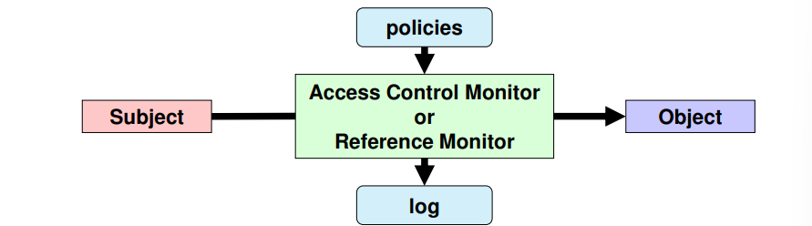

**Definition**
<ul>
    <li>Policies and mechanisms that mediate the access of a subject to an object</li>
</ul>

**Normal requirements**
<ul>
    <li>Authentication: With some Level of Assurance (LoA)</li>
    <li>Authorization policies</li>
    <li>Accountability -> Logging</li>
</ul>

**<p style="text-align: center">Subject and objects: Both digital entities</p>**

**Subjects are <u>something exhibiting activity</u>**
<ul>
    <li>Processes</li>
    <li>Computers</li>
    <li>Networks</li>
</ul>

**Objects are <u>the target of an action</u>**
<ul>
    <li>Stored data</li>
    <li>CPU time</li>
    <li>Memory</li>
    <li>Processes</li>
    <li>Computers</li>
    <li>Networks</li>
</ul>

------------------------------

## Least privilege principle

Every program and every user of the system should opereate using the least set of provileges necessary to complete the job

**Privilege:**
<ul>
    <li>Authorization to perfom a given task</li>
    <li>Similar to access control clearance</li>
</ul>

**Each subject should have, at any given time, the exact privileges required to the assigned tasks**
<ul>
    <li>Less privileges than the required create unsurpassable barriers</li>
    <li>More privileges than the required create vulnerabilities: Damage resulting from accidents or errors; Potential interactions among privileged programs; Misuse of a privileges, Unwanted information flows: "<u>need-to-know</u>"</li>
</ul>

------------------------------

## Access control models 

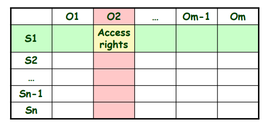

**Access control matrix**
<ul>
    <li>Matrix with all access right for subjects relatively to objects</li>
    <li>Conceptual organization</li>
</ul>

**ACL-based mechanisms**
<ul>
    <li>ACL: Access Control List</li>
    <li>Matrix column</li>
</ul>

**List of access rights for specific subjects**
<ul>
    <li>Access rights can be positive or negative</li>
    <li>Default sunjects may often be used</li>
</ul>

**Usually, ACLs are stored along with objects**
<ul>
    <li>e.g, for file system objects</li>
</ul>

**Capability-based mechanisms**
<ul>
    <li>Capability: unforgeable authorization token</li>
    <li>Matrix row</li>
    <li>Contains onject references and access rights</li>
</ul>

**Access granting**
<ul>
    <li>Transmission of capabilitiees between subjects</li>
    <li>Mediated / non-mediated</li>
</ul>

**Usually, capabilities are kept by subjects**
<ul>
    <li>e.g, OAuth 2.0 access tokens</li>
</ul>

------------------------------

## Access control kinds: MAC and DAC

**Mandatory access control (MAC)**
<ul>
    <li>Fixed access control policy implemented by the access control</li>
    <li>Access control rights cannot be tailored by subjects or objects or object owners</li>
</ul>

**Discretionary access control (DAC)**
<ul>
    <li>Some subjects can update rights granted or denied to other subjects for a given object</li>
    <li>Usually this is granted to object owners and system administrators</li>
</ul>

------------------------------

## Access control kinds: Role-Based Access Control (RBAC)

**Not DAC or MAC**
<ul>
    <li>Roles are dynamically assigned to subjects</li>
    <li>For access control it matters the role played by the subject and not the subject's identity: Identity is mostly relevant for role acess and logging</li>
</ul>

**Access control binds roles to (meaningful) operations**
<ul>
    <li>Operations are complex, meanigful system transactions: Not the ordinary, low-level read/write/execute actons on individual objects</li>
    <li>Operations can involve many individual lower-level objects</li>
</ul>

------------------------------

## Access control kinds: RBAC rules (1/2)

- **Role assignment**
    - All subject activity on the system is conducted through transactions: And transactions are allows to specific roles; Thus, all active subjects are required to have some active role

    - A subject execute a transaction **iff** it has selected or been assignes a role which can use the transaction


## Access control kinds: RBAC rules (2/2)

- **Role authorization**
    - A suject's active role must be authorized for the subject

- **Transaction authorization:**
  - A subject xan execute a transaction **iff**: the transaction is authorized through the subject's role memberships
  - and: there are no other constraints that may be applied across subjects, roles, and permissions

------------------------------

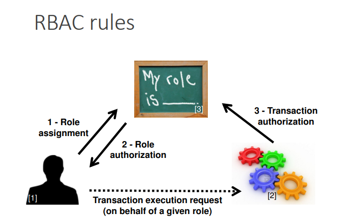

------------------------------

## RBAC: Roles vs groups

- **Roles are a collection of permissions**
  - The permissions are granted to the subjects that, at a given instant, play the role
  - A subject can (should) only play a role at a given time

- **Groups are a collection of users**
  - And permissions can be granted both to users and groups
  - A subject can belong to many groups at a given time

- **The session concept**
  - Role assignment is like a session activation
  - Group menbership is ordinarily a static attribute

------------------------------

## RBAC variants

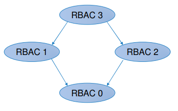

- **RBAC 0**
  - No role hierarchies
  - No role constraints

- **RBAC 1**
  - RBAC 0 w/ role hierarchies (privilege inheritance)

- **RBAC 2**
  - RBAC 0 w/ role contraints (separation of duties)

- **RBAC 3**
  - RBAC 1 + RBAC 2

------------------------------

## NIST RBAC model

- **Flat RBAC**
  - Simple RBAC model w/ **user-role review**

- **Hierarchical RBAC**
  - Flat RbAC w/ role hierarchies (DAg or tree)
  - General and restricted hierarchies

- **Constraint RBAC**
  - RBAC w/ role constraints for separation of duty

- **Symmetric RBAC**
  - RBAC w/ **permission-role review**

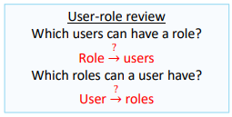
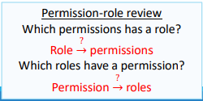

------------------------------

## Access control kinds: Context-Based Access Control (CBAC)\

- **Access rights have an historical context**
  - The access rights cannot be determined without reasoning about past access operations
  - Example: Stateful packet filter firewall

- **Chinese Wall policy**
  - Conflict groups
  - Access control policies need to address past accesses to objects in different members of conlfict groups

## Access control kinds: Attribute-Based Access Control (ABAC)

**Access control decisions are made based on attributes associated with relevant entities**

- **OASIS XACML architecture**
  - Policy Administration Point (PAP): Where policies are managed
  - Policy Decision Point (PDP): Where authorization decisions are evaluated and issued
  - Policy Enforcement Point (PEP): Where resource access requests are intercepted and confronted with PDP’s decisions
  - Policy Information Point (PIP): Where the PDP gets external information

------------------------------

## XACML: Access control with PEP and PDP

- **A subject sends a request**
  - Which is intercepted by the Policy Enforcement Point (PEP)
  - The PEP send an authorization request to the Policy Decision Point (PDP)

- **The PDP evaluates the authorization request against its policies and reaches a decision**
  - Which is returned to the PEP
  - Policies are retrives froma Policy Retrieval Point (PRP)
  - Useful attributes are fetched from Policy Informatino Point (PIP)
  - Policies are managed by the Plicy Administration Point (PAP)

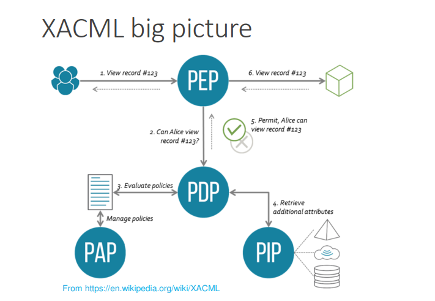

------------------------------

## Break-the-glass access control model

- **In some scenarios it may be required to overcome the estabilished access limitations**
  - e.g., in a life-threatening situation

- **In those cases, the subject may be presentes with a break-the-glass decision up a deny**
  - Can overcome the deny at their own reponsibility
  - Logging is fundamental to prevent abuses

------------------------------

## Separation of duties

- **Fundamental security requirement for fraud and error prevention**
  - Disseminatino of tasks and associated privileges for a specific bussiness process among multiple subjects
  - Often implmented with RBAC

- **Damage control**
  - Segregation of suties helps reducing the potential damage from the actions of one person
  - Some duties should not be combined into one position

------------------------------

## Segregation of duties

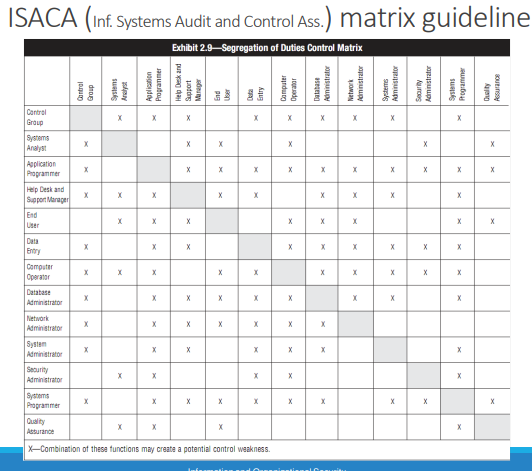

------------------------------

## Informatino flow models

- **Authorization is applies to data flows**
  - Considering the data flow source and destination
  - Goal: avoid unwanted/dangerous indormation flows

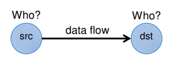

- **Src and Dst security-level attributes**
  - Information flows shoulld occur only between entities with given security level (SL) attributes

------------------------------

## Multilevel security

- **Subjects (or roles) act on different security levels**
  - Levels do not intersect themselves
  - Levels hame some partial order: Hierarchy; Lattice

- **Levels are used as attributes of subjects and objects**
  - Subjects: <u>security level clearance</u>
  - Objects: <u>security classification</u>

- **Information flows & security levels**
  - Same security level -> authorized: Still, subject to a "need to know"
  - Different security levels -> controlled

------------------------------


## Multilevel security levels: Military / Intelligence organizations

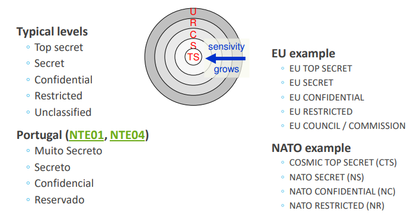

------------------------------

## Security categories (or compartments)

- **Self contained iformatino environments**
  - May span several security levels

- **Military environments**
  - Military branches, military units

- **Civil environments**
  - Departments, organizational units

- **An object can belong to different compartments and have a different security classification in each of them**
  - (top-secret, crypto), (secret, weapon)

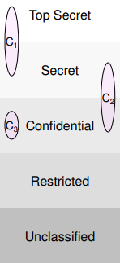

------------------------------

## Security labels

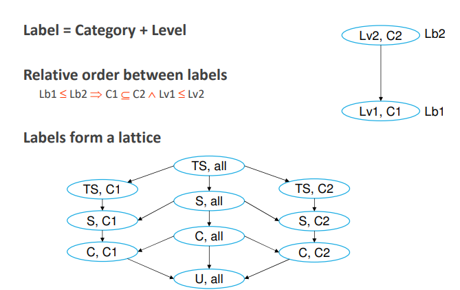

------------------------------

## Bell-La Padula MLS Model

- **Access control policy for controlling information flows**
 - Addresses data confidentiality and access to classified information
 - Addresses disclosure of classified information
 - Object access control is not enough
 - One needs to restrict the flow of information from a source to authorized destinations

- **Uses a state-transition model**
  - In each state there are subjects, objects, an access matrix and the current access information
  - State transition rules
  - Security levels and clearances
  - Objects have a security labels
  - Subjects have security clearances
  - Both refer to security levels (e.g., CONFIDENTIAL)

------------------------------

## Bell-La Padula MLS Model: Secure state-transition model

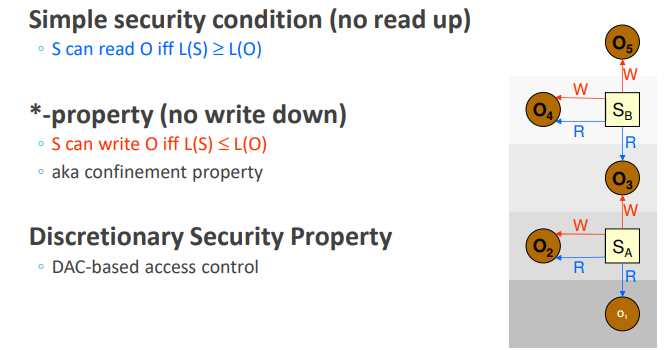

------------------------------

## Biba Integrity Model

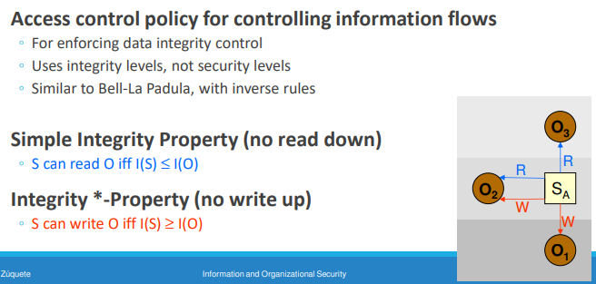

------------------------------

## Windows mandatory integrity control

- **Allows mandatory (priority and critical) access control enforcement prior to evaluate DACLs**
  - If access is denied, DACLs are not evaluated
  - If access is allowed, DACLs are evaluated

- **Integrity labels**
  - Untrusted
  - Low (or AppContainer)
  - Medium
  - Medium Plus
  - High
  - System
  - Protected Process

- **Users**
  - <u>Medium</u>: standard users
  - <u>High</u>: elevated users

- **Process integrity level**
  - The minimum associated to the owner and the executable file
  - User processes usually are <u>Medium</u> or <u>High</u>: except if executing <u>Low</u>-labeled executables
  - Service processes: <u>High</u>

- **Securable objects mandatory label**
  - <u>NO_WRITE_UP</u> (default)
  - <u>NO_READ_UP</u>
  - <u>NO_EXECUTE_UP</u>

------------------------------

# 4º Slide -> Operating systems

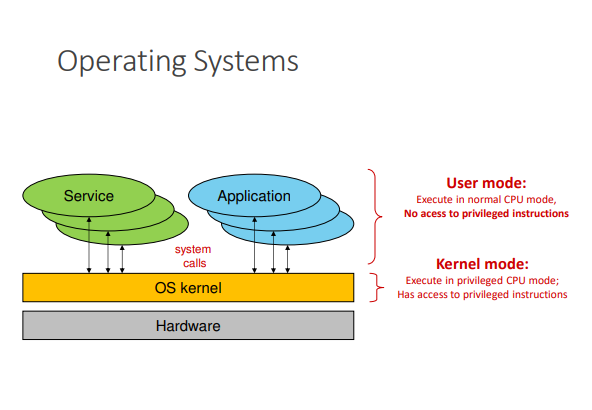

------------------------------

## Kernel Objectives

- **Initialize devices(boot time)**
  
- **Virtualize the hardware**
  - Computational model

- **Enforce protection policies and provide protection mechanisms**
  - Against involuntary mistakes
  - Against non-authorized activities

- **Provide a file system**
  - Agnostic of the actual storage devices used

------------------------------

## Execution Rings

- **Different levels of privilege**
  - Forming a set of concentric rings
  - Used by CPUs to prevent non-privileged code from running privileged opcodes: e.g., IN/OUT, TLB manipulation

- **Nowadays processors have 4 rings**
  - But OS's usually use only 2: 0 (supervisor/kernel mode); 3 (user-mode)

- **Transfer of control between rings requires special gates**
  - The ones that are used by system calls (aka syscalls): Traps
  - Interrupts gates

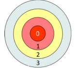

------------------------------

## Executing Virtual Machines

- **Common approach**
  - Software-based virtualization
  - Direct execution of guest user-mode code (ring 3)
  - Binary translation of privileged code (ring 0): Guest OS kernels remain unchanged, but do not run directly on the host machine

- **Hardware-assisted virtualization**
  - Full virtualization: There is a ring -1 below ring 0 -> Hypervisor and kernel extensions such as Intel VT-x and AMD-V
  - It can virtualize hardware for many ring 0 kernels: No need of binary translation; Guest OS’s run faster (almost native performance)

- **Virtual machines implemente an essential security mechanism: confinement**
  - Implement a security domain constrained for use of a small set of applications
  - Also provide a common abstraction with common hardware: Even if the host hardware is modified

- **Provide additional mechanisms**
  - Control resources
  - Prioritize access to resources
  - Creation of images for analysis
  - Fast recovery to a known state

------------------------------

## Computational Model

- **Set of entities (objects) managed by the OS kernel**
  - Define how applications interact with the kernel

- **Examples**<br>
◦ User identifiers<br>
◦ Processes<br>
◦ Virtual memory<br>
◦ Files and file systems<br>
◦ Communication channels<br>
◦ Physical devices<br>
◦ Storage<br>
◦ Magnetic disks, optical disks, silicon disks, tapes<br>
◦ Network interfaces<br>
◦ Wired, wireless<br>
◦ Human-computer interfaces<br>
◦ Keyboards, graphical screens, text consoles, mice<br>
◦ Serial/parallel I/O interfaces<br>
◦ USB, Bluetooth<br>
◦ Serial ports, parallel ports, infrared<br>

------------------------------

## User Identifiers (UID)

- **For the OS kernel a user is a number**
  - Established during a login operation
  - User ID (UID)

- **All activities are executed on a computer on behalf of a UID**
  - UID allows the kernel to assert what is allowed/denied to them
  - Linux: UID 0 is omnipotent (root): Administration activities are usually executed with UID 0
  - macOS: UID 0 is omnipotent for management: Some binaries and activities are restricted, even for root
  - Windows: concept of privileges: For administration, system configuration, etc.; There is no unique, well-known administrator identifier; Administration privileges can be bound to several UIDs (Usually through administration groups; Administrators, Power Users, Backup Operators)

------------------------------

## Group Identifiers (GID)

- **OS also address group identifiers**
  - A group is composed by zero or more users
  - A group may be composed by other groups
  - Group ID: Integer value (Linux, Android, macOS) or UUID (Windows)

- **User may belong to multiple groups**
  - User rights = rights of its UID + rights of its GIDs

- **In Linux, activities always execute under the scope of a set of groups**
  - 1 primary group: user to define the ownership of created files
  - Multiple secondary groups: used to condition access to resources

------------------------------

## Processes

- **A process defines the context of an activity**
  - For taking security-related decisions
  - For other purposes (e.g., scheduling)

- **Security-related context**
  - Effective Identity (eUID and eGIDs): Fundamental for enforcing access control; May be the same as the identity of the user launching the process
  - Resources being used: Open files (Including communication channels); Reserved virtual memory areas; CPU time used, priority, affinity, namespace

------------------------------

## Virtual Memory

- **The address space where activities take place**
  - Have the maximum size defined by the hardware architecture
  - Managed in small chunks named pages (4 KiB)

- **Virtual Memory can be sparse**
  - Only the pages used must be allocated
  - Although processes always see a contiguous memory space

- **Virtual Memory is mapped to RAM when actually used**
  - At a given moment, the RAM has pages from multiple address spaces
  - The choice of how to manage those spaces is very important (Avoid fragmentation, management memory according to their freshness)

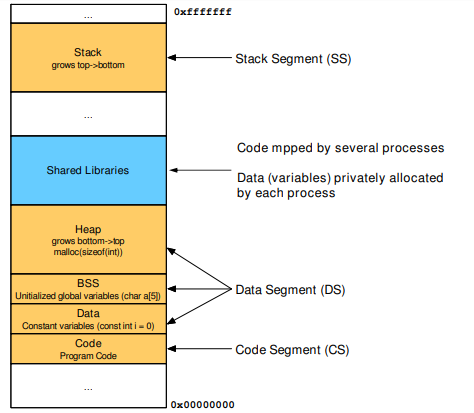

------------------------------

## File System: objects

- **Hierarchical structure for storing content**
  - Provide a method for representing mount points, directories, files and links

- **Mount Point**
  - An access to the root of a specific FS
  - Windows uses letters (A:, .. C:..)
  - Linux, macOs, Android use any directory

- **Links**
  - Indirection mechanisms in FS
  - Soft Links: point to another feature in any FS
  - Hard Links: provide multiple identifiers (names) for the same content (data) in the same FS (Usually allowed only for files)

- **Directory (or folder)**
  - A hierarchical organization method (similar to a container)
  - Can contain other directories, files, mount points, links
  - The first (or top-most) is called by root

------------------------------

## File System: files

- **Serve to store data on a persistent way**
  - But longevity is given by physical support and not by the file concept ...
  - Erasing often means marked as deleted

- **Ordered sequences of bytes associated with a name**
  - The name allows you to retrieve/reuse these bytes later
  - Its contents can be changed, removed, or added (as well as the name)
  - They have a protection that controls their use (Read, write, run, remove, lock, etc. permissions; The protection model depends on the file system)

------------------------------

## File System: security mechanisms

- **Mandatory protection mechanisms**
  - Owner
  - Users and Groups allowed 
  - Permissions: Read, Write, Run (Different meanings for Files and Directories)

- **Discretionary protection mechanisms**
  - User-defined specific rules

- **Additional mechanisms**
  - Implicit compression
  - Indirection to remote resources (e.g., for OneDrive) 
  - Signature
  - Encryption

------------------------------

## Communication Channels

- **Allow the exchange of data between distinct but cooperative activities**

- **Essential in any current system**
  - All applications use these mechanisms

- **Processes of the same SO/machine**
  - Pipes, UNIX Sockets, streams, etc.
  - Communication between processes and kernel: syscalls, sockets

- **Processes on different machines**
  - TCP/IP and UDP/IP sockets

------------------------------

## Access Control

- **An OS kernel is an access control monitor**
  - Controls all interactions with the hardware
  - Applications NEVER directly access resources
  - Controls all interactions between computational model entities

- **Subjects**
  - Typically, local processes: Through the system calls API; A syscall is not an ordinary call to a function
  - But also messages from other machines

```c
#include <stdlib.h>
#include <stdio.h>
#include <string.h>

int main(int argc, char** argv){
  FILE *fp = fopen("hello.txt", "wb");
  char* str = "hello world";
  fwrite(str, strlen(str), 1, fp);
  fclose(fp);
}

```

```bash
$ gcc -o main ./main

$ strace ./main
....
openat(AT_FDCWD, "hello.txt", O_WRONLY|O_CREAT|O_TRUNC, 0666) = 3
fstat(3, {st_mode=S_IFREG|0644, st_size=0, ...}) = 0
write(3, "hello world", 11) = 11
close(3) = 0
...
```
------------------------------

## Mandatory Access Control

- **There are numerous cases of mandatory access control on an operating system**
  - They are part of the logic of the computational model 
  - They are not moldable by users and administrators: Unless they change the behavior of the kernel

- **Examples on Linux**
  - root can do everything
  - Signals to processes can only be sent by root or the owner 
  - Sockets AF_PACKET (RAW) can only be created by root or by processes with the CAP_NET_RAW

- **Examples on macOS**
  - root can do almost anything
  - root cannot change binaries and directories signed by Apple

------------------------------

## Discritionary Access Control

- **Users can set rules for access control**
  - May be definable only by the owner/user: This limitation is itself a Mandatory Access rule

- **Examples**
  - Discretionary Access Control Lists (ACL): Expressive lists that limit access to resources Linux
  - Linux Apparmor: Stores settings in /etc/apparmor.d with application limitations; Rules applied automatically to applications regardless of user
  - macOS sandboxd: Applications are launched within isolated contexts (sandbox); The sandbox contains a definition of the information that enters/exits

------------------------------

## Protection with ACLs

- **Each object has an Access Control List (ACL)**
  - Tell me who can do what

- **The ACL may be discretionary or mandatory**
  - When it is mandatory you cannot change
  - When it is discretionary it can be changed

- **It is checked when an activity intends to manipulate the object**
  - If the manipulation request is not authorized it is denied
  - The SO kernel makes the ACL validations: Acts as a Reference Monitor

------------------------------

## Unix file protection ACLs: Fixed-structure, discretionary ACL

- **Each file system object has an ACL**
  - Binding 3 rights to 3 subjects
  - Only the owner can update the ACL

- **Rights: <u>R W X</u>**
  - Read right / Listing right
  - Write right / create or remove files or subdirectories
  - Execution right / use as process’ current working directory

- **Subjects**
  - An UID (owner)
  - A GID
  - Others

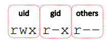


```bash
[nobody@host ~]$ ls -la
total 12
drwxr-xr-x 2 root root 100 dez 7 21:39 .
drwxrwxrwt 25 root  root 980 dez 7 21:39 ..
-rw-r----- 1 root root 6 dez 7 21:42 a
-rw-r--r-- 1 root root 6 dez 7 21:42 b
-rw-r-x---+ 1 root root 6 dez 7 21:42 c 

[nobody@host ~]$ cat a
cat: a: Permission denied

[nobody@host ~]$ cat b
SIO_B
[nobody@host ~]$ cat c
SIO_C

[nobody@host ~]$getfacl c
# file: c
# owner: root
# group: root
user::rw
user:nobody:r-x
group::r--
mask::r-
other::--- 
```
------------------------------

## Windows file protection ACLs: Flexible-structure, discretionary ACL

- **Each file system object has an ACL and an owner**
  -The ACL grants 14 types of access rights to a variable-size list of subjects
  -Owner can be an UID or a GID
  -Owner has no special rights over the ACL

- **Subjects**:
  -Users (UIDs)
  -Groups (GIDs): The group “Everyone” stands for anybody

- **Rights**:
  -Traverse Folder / Execute File
  -List Folder / Read Data
  -Read Attributes
  -Read Extended Attributes
  -Create Files /Write Data
  -Create Folders / Append Data
  -Write Attributes
  -Write Extended Attributes
  -Delete Subfolders and Files
  -Delete
  -Read Permissions
  -Change Permissions
  -Take Ownership

------------------------------

## Privilege Elevation: Set-UID

- **It is used to change the UID of a process running a program stored on a Set-UID file**
  -If the program file is owned by UID X and the set-UID ACL bit is set, then it will be executed in a process with UID X, independently of the UID of the subject that executed the program

- **It is used to provide privileged programs for running administration task invoked by normal, untrusted users**
  -Change the user’s password (passwd)
  -Change to super-user mode (su, sudo)
  -Mount devices (mount)

- **Effective UID / Real UID**
  - Real UID is the UID of the process creator
  - App launcher
  - Effective UID is the UID of the process
  - The one that really matters for defining the rights of the process

- **UID change**
  - Ordinary application: eUID = rUID = UID of process that executed exec; eUID cannot be changed (unless = 0)
  - Set-UID application: eUID = UID of exec’d application file, rUID = initial process UID; eUID can revert to rUID
  - rUID cannot change

- **Administration by root is not advised**
  - One “identity”, many people
  - Who did what?
  - 
- **Preferable approach**
  - Administration role (uid = 0), many users assume it
  - Sudoers
  - Defined by a configuration file used by sudo
  - 
- **sudo is a Set-UID application with UID = 0**
  - Appropriate logging can take place on each command run with sudo

```bash
[user@linux ~]$ ls -la /usr/sbin/sudo
-rwsr-xr-x 1 root  root 140576 nov 23 15:04/usr/sbin/sudo] 
[user@linux ~]$ id
uid=1000(user) gid=1000(user) groups=1000(user),998 (sudoers)

[user@linux ~] $ sudo -s
[sudo] password for user:

[root@linux ~]# id
uid=0(root) gid=0(root) groups=0(root)

[root@linux ~]# exit

[user@linux ~]$ sudo id
uid=0(root) gid=0(root) groups=0(root)
```
------------------------------

## Linux login: Not an OS kernel operation

- **A privileged login application presents a login interface for getting users’ credentials**
  - A username/password pair
  - Biometric data
  - Smartcard and activation PIN
  - 
- **The login application validates the credentials and fetches the appropriate UID and GIDs for the user**
  - And starts an initial user application on a process with those identifiers: In a Linux console this application is a shell
  - When this process ends the login application reappears
  - 
- **Thereafter all processes created by the user have its identifiers**
  - Inherited through forks

------------------------------

## Linux: from login to session processes

- **The login process must be a privileged process**
  - Has to create processes with arbitrary UID and GIDs: The ones of the entity logging in

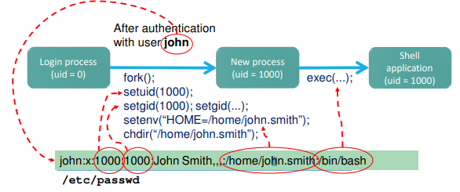

------------------------------

## Login in Linux: Password validation process

- **Username is used to fetch a UID/GID pair from /etc/passwd**
  - And a set of additional GIDs in the /etc/group file
  - 
- **Supplied password is transformed using a digest function**
  - Currently configurable, for creating a new user (/etc/login.conf)
  - Its identification is stored along with the transformed password
  - 
- **The result is checked against a value stored in /etc/shadow**
  - Indexed again by the username
  - If they match, the user was correctly authenticated
  - 
- **File protections**
  - /etc/passwd and /etc/group can be read by anyone: Required for UID/GID  user name / group name translations
  - /etc/shadow can only be read by root: Protection against dictionary attacks

------------------------------

## Chroot mechanism

- **Used to reduce the visibility of a file system**
  - Each process descriptor has a root i-node number: From which absolute pathname resolution takes place
  - chroot changes it to an arbitrary directory: The process’ file system view gets reduced

- **Used to protect the file system from potentially problematic applications**
  - e.g., public servers, downloaded applications
  - But it is not bullet proof!

------------------------------

## Confinement: AppArmor

- **Mechanism for restricting applications based on a behavior model**
  - Requires kernel support: Linux Security Modules
  - Focus on syscalls and their arguments
  - Can work in complain and enforcement modes
  - Generates entries in the system registry to audit the behavior
- **Configuration files define allowed activities**
  - Whitelisting
  - By application, uploaded from a file
  - Applications can never have more accesses than defined: Even if executed by root

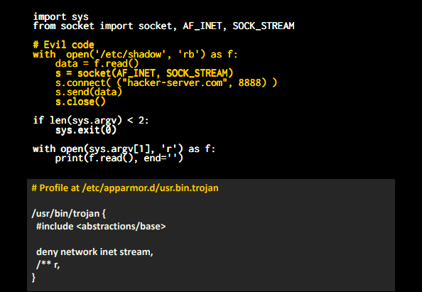
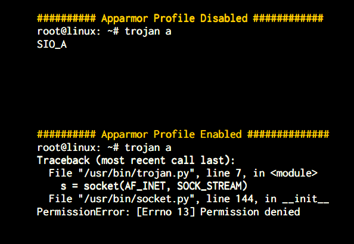

------------------------------

## Confinement: Namespaces

- **Allows partitioning of resources in views (namespaces)**
  - Processes in a namespace have a restricted view of the system
  - Activated through syscalls by a simple process: clone: Defines a namespace to migrate the process to; unshare: disassociates the process from its current context; setns: puts the process in a Namespace
- **Types of Namespaces**
  - Mount: Applied to mount points
  - process id: first process has id 1
  - network: "independent" network stack (routes, interfaces...)
  - IPC: methods of communication between processes
  - uts: name independence (DNS)
  - user id: segregation of permissions
  - cgroup: limitation of resources used (memory, cpu...)

------------------------------

## Confinement: Containers

- **Explores namespaces to provide a virtual view of the system**
  - Network isolation, user ids, mounts, cgroups, etc...
- **Processes are executed under a container**
  - A container is an applicational construction and not a kernel object
  - Consists of an environment by composition of namespaces and cgroups
  - Requires building bridges with the real system network interfaces, proxy processes
- **Relevant approaches**
  - LinuX Containers: focus on a complete virtualized environment: evolution of OpenVZ
  - Docker: focus on running isolated applications based on a portable packet between systems: uses LXC
  - Singularity: similar to docker, focus on HPC and multi-user sharing

------------------------------

# 5º Slide -> Defending an Organization

## Current requirements
1. Identify security accountable individual<br>
  • Responsible for the Security Strategy<br>
  • Typically called CISO: Chief Information Security Officer<br>
  • Will be personally held accountable!<br><br>
1. Identify contact points for the organization<br><br>
2. Identify and track the critical assets<br>
  • Crown Jewels<br><br>
1. Have a security plan<br><br>
2. Report relevant incidents and cooperate<br>

## Assets: Crown Jewels Approach

- **Focused on identifying and protecting the most critical assets**
  - To the organization mission!

- **What is a crown jewel?**
  - Sensitive Data
  - Servers
  - Software Systems
  - Any other equipment (HVAC, Generators…)
  
- **Disruption to the crown jewels will pose a serious impact to the organization mission**
  - Objective: Protect the crown jewels
  - and grow from there to the rest of the organization
  - based on a risk assessment

## Security Plan

- **Live document describing the security posture**
  - Allows organizations to know where they are and where they want to go
  - Considers authentication, backups, risk, access control, policies, etc.
  
- **Accepted by the organization, signed by Security Principal**
  - Periodically reviewed and improved

- **Written and accepted policies implies higher maturity**
  - Organizations frequently only have word of mouth or informal frequent practices

## Incident Response and Coordination

- **Incident response coordinated by CERT.PT**
  - Relevant incidents must be reported
 
- **National CSIRT Network facilitates collaboration between entities**
  - https://www.redecsirt.pt

- **Fraud/Crime incidents are reported to authorities**
  - Unidade Nacional de Combate ao Cibercrime e à Criminalidade Tecnológica (UNC3T): unc3t@pj.pt

## Security Teaming

- **Security operations are frequently organized in teams**
  - **Blue Team**: Defends an organization from malicious actors
  - **Red Team**: Attacks an organization to help finding weak spots
  - **Purple Team**: Mixed attack defence role

- **Each team uses specific tools and methods**