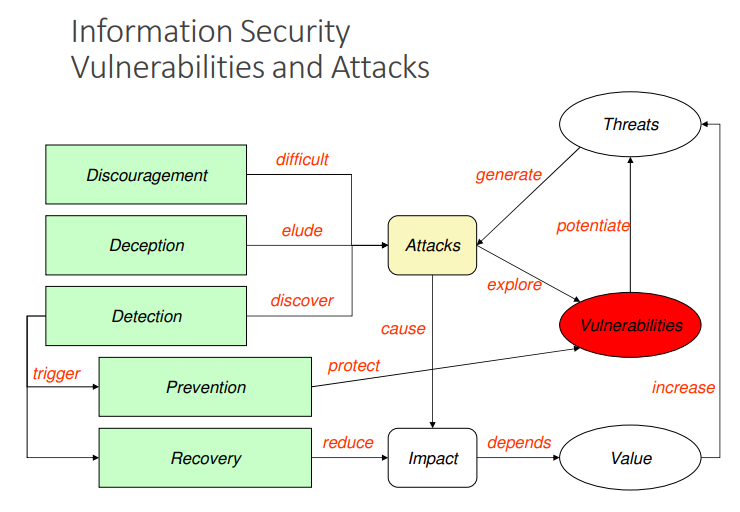
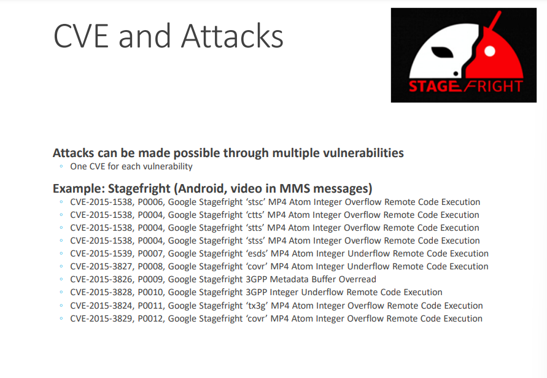
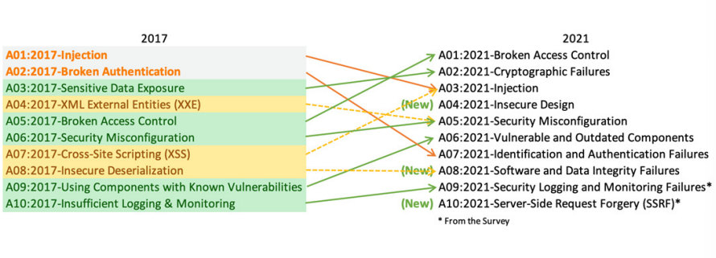
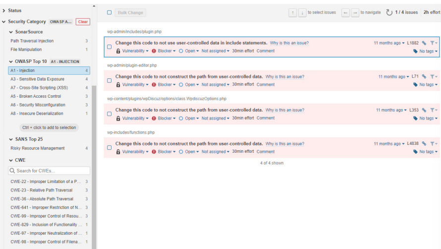
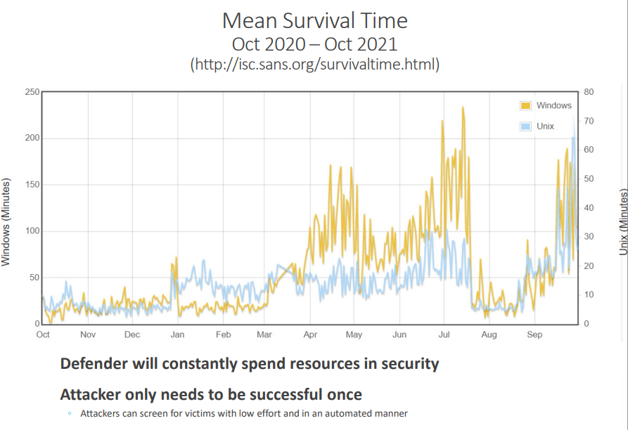

# 1º Slide -> Security

## Predictability of systems, processes, environments

### Across all aspects of the life cycle:

**Planning** -> Design of a solution complying with some requirements under a normative context.
Without flaws: All operations states are the ones predicted; There are no additional states escaping the expected logic (Even if forces transitions are used)

**Development** -> Implement a solution complying with the design, without other operation modes.
Without bugs compromising the correct execution: No crashes; Without invalid or unexpected results; With the correct execution times; With adequate resource consumption; Without information leaks

**Execution** -> Code excutes as it was written, with all predicted processes.
Environment is controlled, cannot be manipulated or observed
Without the existence of anomalous behavior, introduced by environmental aspects (storage speed, RAM amount, trusted communications)

**Processes**;

**People** -> Staff behavior cannot have a negative impact to the solution
Norms are in place to regulate what avtions are expected; Staff is trained to distinguish correct from incorrect behavior; Staff has the correct incentive to behave adequately; When staff is compromised, or deviate, actions have limited impact

Clients and Supply Chain;
Mechanisms;
Standards and Laws;
Intellectual Property;

-------------------------------

### SIO ojectives:

Confidentiality;
Integrity: Information remains unchanged;
Availability: Information is available to target entities;
Privacy: How personal information is handled;
Measures;

------------------------------

### Security objectives:

Defense against catastrophic events;
Degradation of computer hardware;
Defense against ordinary faults / failures;
Defense against non-authorized activities (adversaries)

------------------------------

#### Core Concepts:

1. Domains -> A set of entities sharing similar security attributes
Allow managing security in an aggregated manner;
Behavior and interactions are homogenousinside the domain;
Domains can be organized in a flat of hierarchical manner;
Interactions between domains are usually controlled;

2. Policies -> Set of guidelines related to security, that rule over a domain

Organization will contain multiple policies;
The multiple policies  must be coherent;
Define the power of each subject;
Define security procedures;
Define the minimun security requirements of a domain;
Define defense strategies and fight back tactics;
Define what are legal and illegal activities;

3. Mechanisms -> Mechanisms implement policies:

Policies define, at a higher level, what needs to be done or exist
Mechanisms are used to deply policies

4. Controls -> Controls are any aspect allowing to minimize risk (protect the CIA properties)

Cotrols include policies & mechanisms, but also Standars and Laws, Processes, Techniques
Controls are explicitly stated and can be auditable

------------------------------

**Policy**: Movement between domains is restricted
Mechanisms: Doors, guards, passwords, objects/documents

**Mechanism**: systems must be resilient
Mechanisms: equipments and links are doubled, arquitecture

------------------------------

### Types of Security Controls:

|                | Prevention                                                            | Detection                       | Correction                                                                 |   |
|----------------|-----------------------------------------------------------------------|---------------------------------|----------------------------------------------------------------------------|---|
| Physical       | -Fences -Gates -Locks                                                 | -CCTV                           | -Repair Locks -Repair Windows -Redeploy access cards                       |   |
| Technical      | -Firewall -Authentication Antivirus                                   | -Intrusion -Alarms -Honeypots   | -Vulnerability patching -Reboot Systems -Redeploy VMs -Remove Virus        |   |
| Administrative | -Contractal clauses -Separation of Duties -Information Classification | -Review Access Matrixes -Audits | -Implement a business continuity plan -Implement an incident response plan |   |

------------------------------

### Practical Security: Realistic Prevention

Consider Impact;
Consider the cost and recover time;
Characterize attackers;
Consider that the system will be compromised;

------------------------------

### Security in computing systems: Complex problems

Computers can do much damage in short time frames;
The number of weakness is always growing;
Networks allow novel attack mechanisms;
Attackers can build complex attck chains;
Users are mostrly unaware of the risks;
Users are mostly careless;

------------------------------

### Main vulnerability sources:

Hostile applications or bugs in applications;
Users;
Defective administration;
Communication over uncontrolled/unknown network links

------------------------------

### Perimeter Defense (minimal defense, frequently not sufficient)

Protection against external attackers;
Assumes that internal users are trusted and share the same policies;
Used in domestic scenarios or small offices;
Limitaions: Too simple, Doesn't protect against internal attackers

------------------------------

### Defense in Depth:

Protection against internal and external attackers;
Assumes well-defined domains across the organization;
Limitations: Needs coordination between the diferent controls, Cost, Requires training, changes to processes and frequent audits

------------------------------

### Zero Trust:

Defense model without specific perimeters;
Model recommended for new systems

### Zero Trust - Principles (NCSC)

1. Know your architecture (Users, devices, services and data)
2. Know your identities (Users, devices , services and data)
3. Assess user behaviour, servicesand device health
4. Use policies to authhorize requests
5. Authenticate and Authorize everywhere
6. Focus your monitoring on users, devices and services
7. Don't trust any network, including you rown
8. Choose services designed for Zero Trust

------------------------------
# 2º Slide -> Vulnerabilities

## Measures (and some tools):

**Discouragement**
- Punishment: Legal restrictions, Forensic evidences
- Security barriers: Firewalls, Authentication, Secure communication, Sandboxing

**Detection**
- Intrusion detection system: Seek, Bro, Suricata
- Auditing
- Forensic break-in analysis

**Deception**
- Honeypots / honeynets
- Forensic follow-up

**Prevention**
- Restrictive policies: least privilege principle
- Vulnerability scanning: OpenVAS, metasploit
- Vulnerability patching: regular updates

**Recovery**
- Backups
- Reduntant systems
- Forensic recovery

------------------------------

------------------------------
## Vulnerability:

A mistake in software that can be directly used by an attacker to gain access to a system or network

A mistake is a vulnerability <u>if it allows an attacker to use it to violate a reasonable security policy for that system</u>
<ul>
    <li> This excludes entirelly "open" security policies in which all users are trusted, or where there is no consideration of risk to the system
</ul>

A VE vulnerability is a state in a computing system (or set of systems) that either:
<ul>
    <li>Allows an attacker to execute commands as anotehr user</li>
    <li>Allows an attacker to access data that is contrary to the specified access restrictions for that data</li>
    <li>Allows an attacker to pose as another entity</li>
    <li>Allows an attacker to conduct a denial of service</li>
</ul>

------------------------------

## Exposure:

A configuration issues or a mistake in software allowing access to informationor capabilities used as a stepping-stone into a system or network

### A configuration issue or a mistake is an exposure if it does not directly allow compromise
<ul>
    <li>But could be an importat component of a successful attack, and is a violation of a reasonable security policy</li>
</ul>

### An exposure describes a state in a computong system (or set of systems) that id not a vulnerablity, but either:
<ul>
    <li>Allows an attacker to conduct information gathering activities</li>
    <li>Allows an attacker to hide activities</li>
    <li>Includes a capability that behaves as exepected, but can be easily compromised</li>
    <li>Is a primary  point of entry that an attacker may attempt to use to gain access to the system or data</li>
    <li>Is considered a problem by some reasonable security policicy</li>
</ul>

------------------------------

## CVE Common Vulnerabilities and Exposures:

Dictionary of publicly known information security vulnerabilities and exposures
<ul>
    <li>For vulnerability management</li>
    <li>For patch management</li>
    <li>For vulnerability alerting</li>
    <li>For intrusion detection</li>
</ul>

Uses common inndentifiers for the same CVEs
<ul>
    <li>Enable data exchange between security products</li>
    <li>Provide a baseline index point for evaluatingn coverage of tools and services</li>
</ul>

Details about a vulnerability cn be kept private
<ul>
    <li>Part of responsible disclosure: until owner provides a fix</li>
</ul>

------------------------------

## CVE indentifiers:

Aka CVE names, CVE numbers, CVE-IDs, CVEs

Unique, common identifiers for publicly known information security vulnerabilities
<ul>
    <li>Have "candidate" or "entry" status</li>
    <li>Candidate: under review for inclusion in the list</li>
    <li>Entry:accepted to the CVE List</li>
</ul>

Format
<ul>
    <li>CVE identifier number (CVE-Year-Order)</li>
    <li>Status (Candidate or Entry)</li>
    <li>Brief description of the vulnerability or exposure</li>
    <li>References to extra information</li>
</ul>

------------------------------

## CVE benefits:

Provides common language for referring to problems
<ul>
    <li>Facilitates data sharing among</li>
    <li>Itrusion detection systems</li>
    <li>Assessment tools</li>
    <li>Vulnerability databases</li>
    <li>Researchers</li>
    <li>Incident response teams</li>
</ul>

Will lead to improved security tools
<ul>
    <li>More comprehensive, better comparisons, interoperable</li>
    <li>Indications and warning systems</li>
</ul>

Will spark further innovations
<ul>
    <li>Focal point discussing critical database content issues</li>
</ul>

------------------------------

------------------------------

## Vulnerability detection

Specific tools can detect vulnerabilities
<ul>
    <li>Exploiting know vulnerabilities</li>
    <li>Testing know vulnerability patterns (buffer overflow, SQL injection, XSS, etc...)</li>
</ul>

Specific tools can replicate know attacks
<ul>
    <li>Use known exploits for know vulnerabilities(MS Samba v1 exploit used by WannaCry)</li>
    <li>Can be used to implement countermeasures</li>
</ul>

Vital to assert the robustness of production systems and applications
<ul>
    <li>Service often by third-party companies</li>
</ul>

Can be applied to
<ul>
    <li>Source code (static analysis): OWSAP LAPSE+, RIPS, Veracode, ...</li>
    <li>Running application (dynamic analysis): Valgrind, Rational, AppScan, GCC, ...</li>
    <li>Externally as a remote client: OpenVAS, Metasploit, ...</li>
</ul>

Should not be <u>blindly</u> applied to production systems!

<ul>
    <li>Potential data loss/corruption</li>
    <li>Potential DoS</li>
    <li>Potential illegal activity</li>
</ul>

------------------------------

## CWE Common Weakness Enumeration

Common language of discourse for discussing, finding and dealing with causes of software security vuneranilities
<ul>
    <li>Found in code, desig, or system archicture</li>
    <li>Each individual CWV represents a single vulnerability type</li>
    <li>Currently maintained by the MITRE Corporation: A detailed CWE list is currently available at the MITRE website</li>
    <li>The list provides a detailed definition for each individual CWE</li>
</ul>

Indivudual CWEs are held within a hierarchical structure
<ul>
    <li>CWEs at higher levels provide a broad overviwe of a vulnerability type: Can have children CWEs associated with them</li>
    <li>Cwes at deeper leveld provide a finer granularity: Usually have fewer or no children CWEs</li>
</ul>

**
CWE != CVE
**

------------------------------

## Vulnerability types OWASP Top 10 (Web, 2021)

<ol>
    <li>Broken Access control</li>
    <li>Cryptographic Failures</li>
    <li>Injection</li>
    <li>Insecure Design</li>
    <li>Security Misconfiguration</li>
    <li>Vulnerable and Outdated Components</li>
    <li>Indentification and Authentication Failures</li>
    <li>Software and Date Integrity Failures</li>
    <li>Security Logging and Monitoring Failures</li>
    <li>Server-Side Request Forgery(SSRF)</li>
</ol>

------------------------------

## Static Analysis (with Sonarcloud)

------------------------------

## Vulnerability Tracking by vendors

During the development cycle, vulnerabilities are handle as bugs
<ul>
    <li>May have a dedicated security team or not</li>
</ul>

When software id available, vulnerabilities are also tracked globally
<ul>
    <li>For every system and software publicly available</li>
</ul>

Public tracking helps...
<ul>
    <li>Focusing the discussion sround the same issue: Ex: a library is used in multiple applications, distributions</li>
    <li>Defenders to easily test their systems, enhancing the security</li>
    <li>Attackers to easily know what vulnerability can be used</li>
</ul>

------------------------------

## Vulnerability Tracking

Vulnerability are privately tracked
<ul>
    <li>Constitute an arsenal for future attacks against targets</li>
    <li>Exploints are weapons</li>
</ul>

Knowledge about vulnerabilities and exploits is publicly traded
<ul>
    <li>From 0 to 2-3M€ (more?) through direct markets, or acquisition programs</li>
    <li>Up to 2.5M€ for bug hunting programs or direct acquisition (Google, Zerodium): 2.5M€ 1 click Android exploit, 2M€ 1 click iPhone exploit, 1.5M€ WhatsApp or iMessage exploit, ~2k for a XSS at HackerOne (although there are records of $1M payouts)</li>
</ul>

...and privately traded at unkown prices
<ul>
    <li>Private Companies, Organized Crime, APTs</li>
</ul>

------------------------------

## Zero Day (or Zero Hour) Attack/Threat

Attack using vulnerabilities which are:
<ul>
    <li>Unknown to others</li>
    <li>Undisclosed to the software vendor</li>
</ul>

Occurs at the day zero of the knowledge about those vulnerabilities
<ul>
    <li>For wich no secrity fix is available</li>
</ul>

A single "day zero" may exist for months/years
<ul>
    <li>Know to attackers, unknown to others</li>
    <li>Frequently part of attack arsenal</li>
    <li>Traded around in specific markets</li>
</ul>

------------------------------

## Survivability

How can we survie a zero-day attack?

How can we react to a massive zero-day attack?

**Diversity is one answer (as a policy)...**
<ul>
    <li>but software production, distribution and update goes on the opposite direction!: And the same happens with hardware architectures</li>
     <li>Why is MS Windows such an interesting target?: And Apple macOS not so much?</li>
     <li>Are you using and Android cell phone?: What are the odds of beign in the battlefront? (you are); iOS landscape may be worst as it is more homogeneous</li>
</ul>

------------------------------

## CERT Computer Emergency Readinedd Team

**Organization ensuring that approopriate technology and systems' management practises are used to**
<ul>
    <li>Resist attacks on networked systems</li>
    <li>Limit damage, ensure continuity of critical services: In spite of successful attacks, accidents, or failures</li>
</ul>

**CERT/CC (Coordination Center) @ CMU**
<ul>
    <li>One Component of the larger CERT Program</li>
    <li>A major center for internet security problems: Established in November 1988, after the "Morris Worm"; It demonstrated the growing Internet exposure to attacks</li>

## CSIRT Computer Security Incident Response Team

**A service organization responsible for receiving, reviewing, and responding to computer security incident reports and activity**
